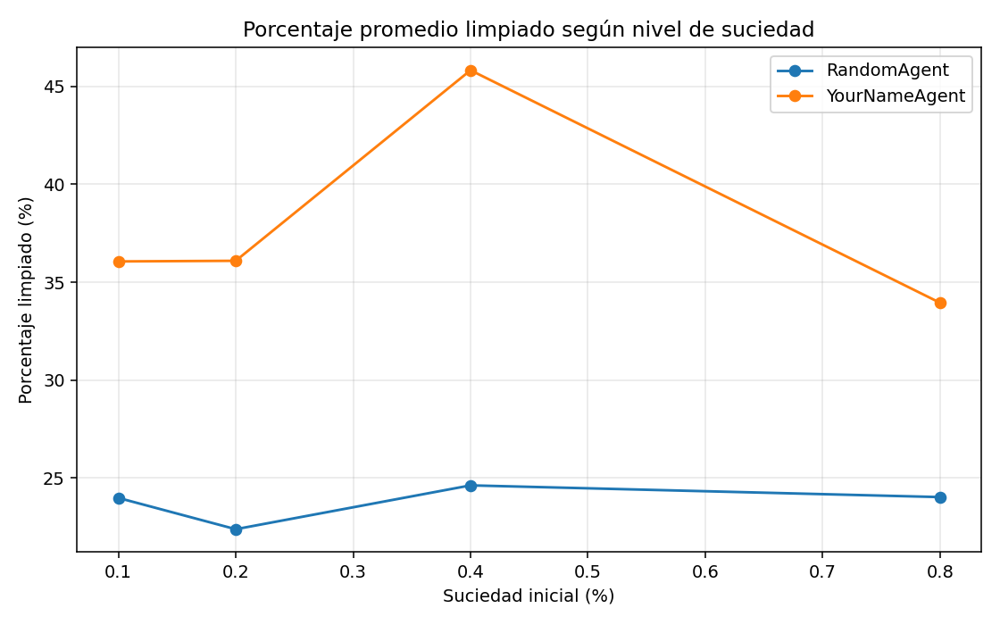
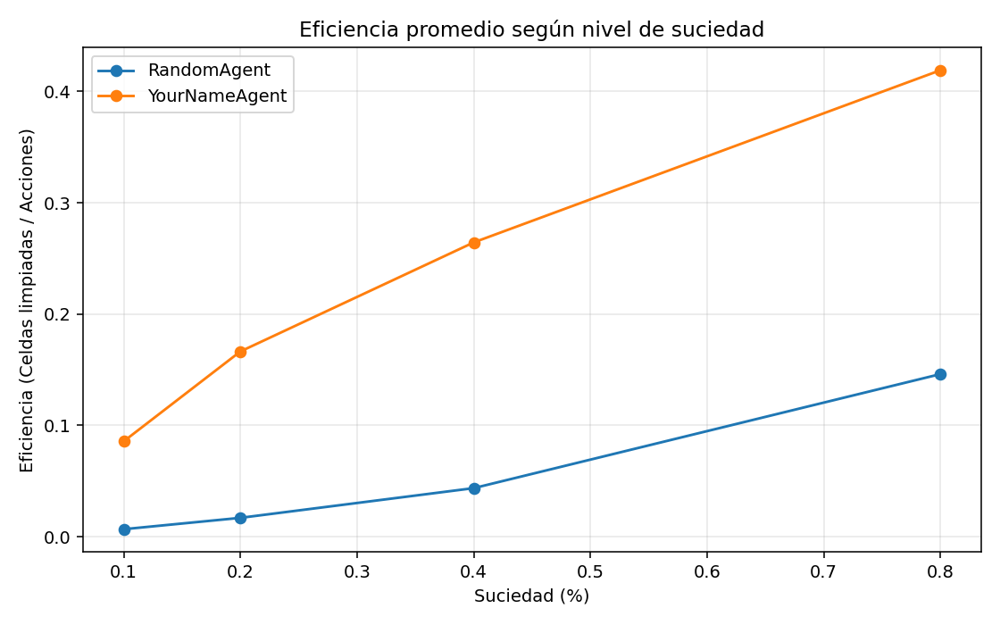
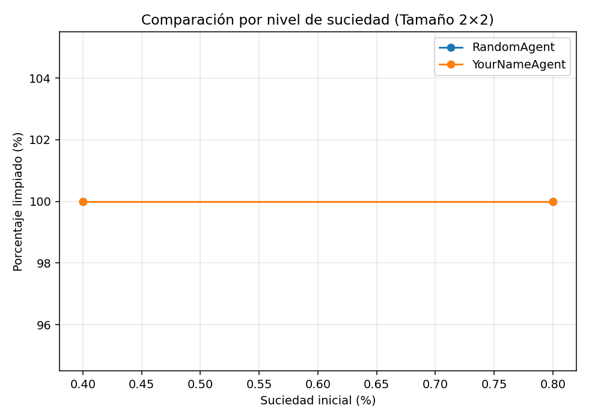
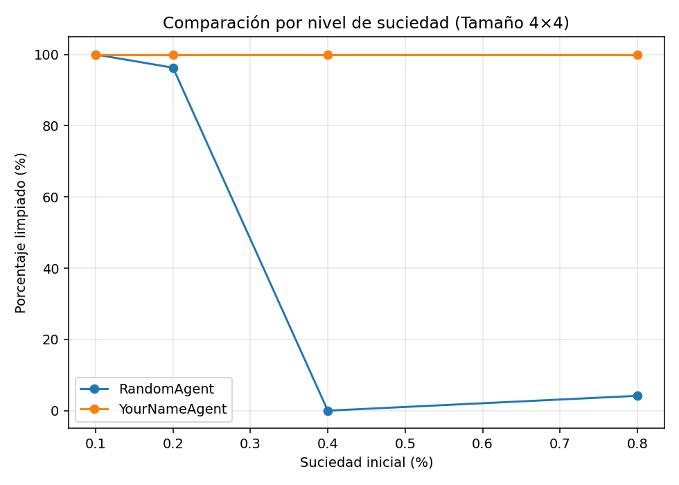
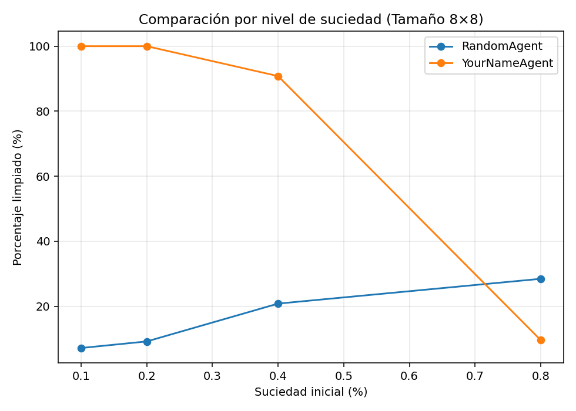
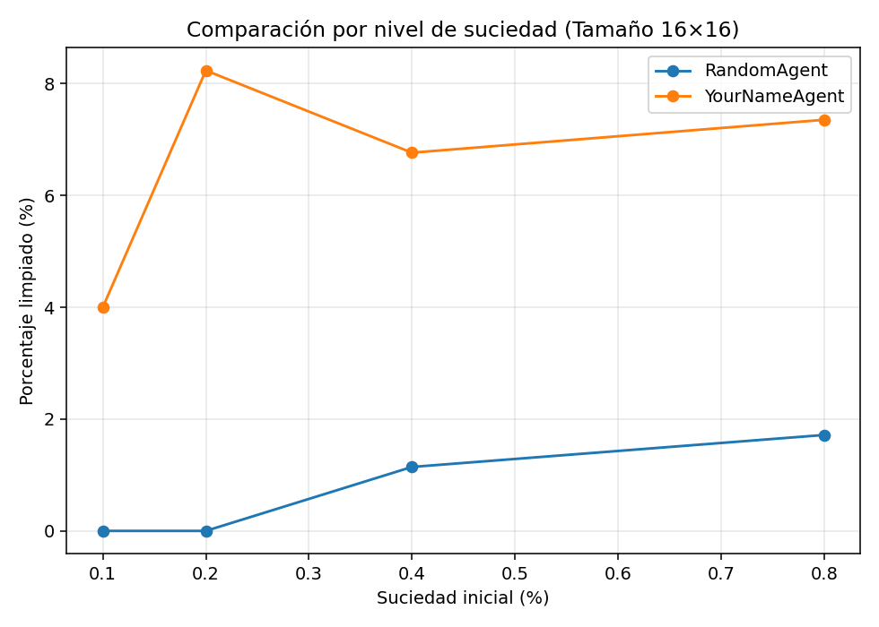
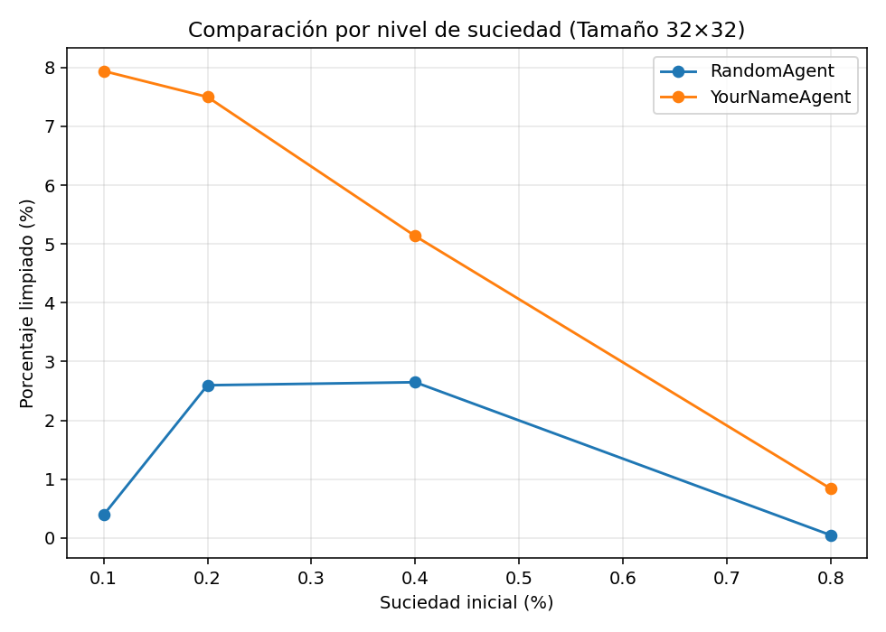
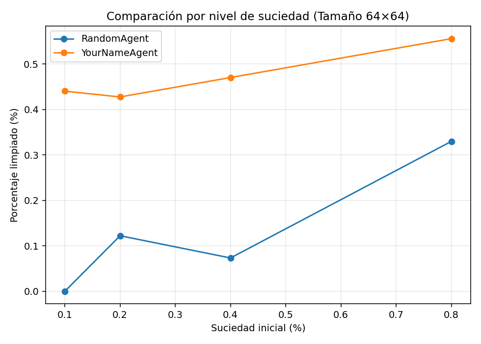
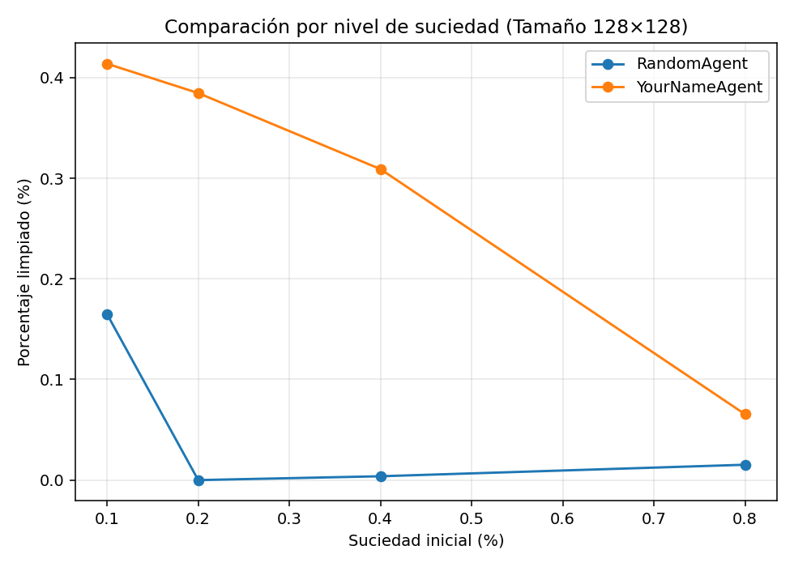

# Comparación de Performance entre un Agente Reflexivo Simple y un Agente Random

##  Introducción
En este trabajo se realizó una simulación comparativa entre dos tipos de agentes inteligentes en un entorno dinámico con distintos tamaños y niveles de suciedad.  
El objetivo fue analizar su desempeño, medir su rendimiento y comparar los resultados obtenidos a través de métricas cuantitativas y visualizaciones.

##  Marco Teórico

###  Funcionamiento del entorno
El entorno es una cuadrícula (*grid*) donde cada celda puede estar limpia o sucia.  
La suciedad se genera de forma aleatoria al inicio de cada simulación, según un porcentaje predefinido.  
El tamaño del entorno varía entre simulaciones (2×2, 4×4, 8×8, 16×16, 32×32, 64×64, 128×128).

Los agentes inician en una celda aleatoria y pueden realizar las siguientes acciones:
- Moverse: arriba, abajo, izquierda, derecha  
- Limpiar (suck)  
- No hacer nada  

Cada acción consume un turno y ambos agentes tienen un máximo de **1000 movimientos por simulación**.  
Reciben **un punto de performance por cada celda sucia limpiada**, sin penalizaciones por movimientos.

###  Tipos de agentes

**1. Agente Reflexivo Simple**  
- Toma decisiones basadas en su percepción inmediata (ubicación y estado de la celda actual).  
- Emplea un patrón determinista tipo *snake* o recorrido sistemático.  

**2. Agente Aleatorio (RandomAgent)**  
- Realiza acciones completamente al azar, sin considerar su entorno ni estado anterior.  

Ambos agentes tienen acceso a las mismas acciones y condiciones iniciales.

##  Diseño Experimental

El experimento consiste en:
1. Crear un entorno con un tamaño y nivel de suciedad determinados.  
2. Posicionar al agente en una celda aleatoria.  
3. Permitirle ejecutar hasta **1000 acciones**.  
4. Repetir la simulación **10 veces por configuración** para obtener promedios más estables.  

### Parámetros experimentales:
| Parámetro | Valores |
|------------|----------|
| Tamaños del entorno | 2×2, 4×4, 8×8, 16×16, 32×32, 64×64, 128×128 |
| Porcentaje de suciedad | 0.1, 0.2, 0.4, 0.8 |
| Repeticiones por configuración | 10 |
| Máx. de acciones por simulación | 1000 |

Los resultados se almacenaron en archivos CSV (`results_random.csv`, `results_reflex.csv`, `results_all.csv`) para posterior análisis y visualización.

##  Análisis y Discusión de Resultados

A partir de los resultados combinados se analizaron diferentes métricas:
- **Rendimiento promedio**
- **Porcentaje de celdas limpiadas**
- **Acciones promedio**
- **Eficiencia (celdas limpiadas / acciones realizadas)**

Los gráficos siguientes muestran las comparaciones obtenidas.

###  Porcentaje de limpieza logrado según nivel de suciedad
*(Relación entre celdas limpiadas y acciones realizadas)*

###  Eficiencia promedio según nivel de suciedad
*(Relación entre celdas limpiadas y acciones realizadas)*

###  Comparaciones detalladas (gráficos individuales)

- **Por cada nivel de suciedad:**
  - 
  - 
  - 
  - 
  - 
  - 
  - 

El experimento permitió observar claramente las diferencias entre un **agente reflexivo simple** y un **agente aleatorio** al enfrentarse al mismo entorno de limpieza bajo las mismas condiciones iniciales.

###  Rendimiento general
El **Agente Reflexivo Simple** logra una **performance significativamente superior** en la mayoría de los escenarios.  
Esto se debe a que sigue una estrategia ordenada y sistemática de recorrido, evitando repetir movimientos innecesarios y aprovechando mejor sus 1000 acciones disponibles.  

En cambio, el **Agente Aleatorio** se comporta sin ningún tipo de planificación ni memoria, lo que provoca movimientos redundantes, baja cobertura del entorno y, en consecuencia, **un porcentaje de limpieza mucho menor**.

###  Impacto del tamaño del entorno
En **entornos pequeños (2×2 y 4×4)** ambos agentes tienen rendimientos similares, ya que la exploración aleatoria cubre fácilmente todas las celdas.  
Sin embargo, al **aumentar el tamaño del entorno**, la diferencia crece notablemente:  
- El agente reflexivo mantiene un rendimiento más estable y consistente.  
- El agente aleatorio cae rápidamente, ya que la probabilidad de pasar por una celda sucia sin estrategia disminuye drásticamente.  

> En los **entornos más grandes (64×64 o 128×128)** ambos agentes tienden a mostrar rendimientos similares, **no porque el aleatorio mejore**, sino porque **el límite de 1000 movimientos impide que el reflexivo complete su recorrido**.  
> En esos casos, ninguno de los dos logra limpiar una fracción significativa del entorno, y las diferencias se reducen artificialmente por la restricción de acciones máximas.

###  Impacto del porcentaje de suciedad
Cuando el porcentaje de suciedad es bajo (0.1 o 0.2), ambos agentes tienden a obtener rendimientos moderados.  
Pero cuando la suciedad inicial es alta (0.4 o 0.8), el agente reflexivo logra **limpiar una proporción mucho mayor del entorno**, mientras que el aleatorio se vuelve aún más ineficiente.

Esto refleja que el **reflexivo escala mejor en entornos complejos**, mientras que el aleatorio no adapta su comportamiento a las condiciones.

###  Análisis de eficiencia
En términos de **eficiencia (celdas limpiadas / acciones totales)**, el agente reflexivo aprovecha más cada movimiento:  
- Realiza más acciones “útiles” (limpieza o desplazamientos hacia zonas sucias).  
- Evita movimientos sin propósito o repeticiones.  

El agente aleatorio, en cambio, desperdicia gran parte de sus 1000 acciones en desplazamientos sin impacto.

###  Conclusión final
> **El agente reflexivo simple demuestra que incluso una estrategia básica, pero racional y sistemática, supera ampliamente a un comportamiento puramente aleatorio.**

Este resultado ilustra uno de los principios fundamentales de la inteligencia artificial:
>  *El conocimiento del entorno y la toma de decisiones informadas generan comportamientos más eficientes, especialmente en contextos grandes o con alta incertidumbre.*

En resumen:
- El **agente reflexivo simple** es más eficiente, más estable y más escalable.  
- El **agente aleatorio** solo es competitivo en entornos pequeños y simples.  
- En entornos grandes, la **limitación de 1000 movimientos** provoca que ambos agentes se comporten de forma similar, ya que ninguno alcanza a recorrer una porción relevante del mapa.  
- Los resultados son coherentes con la teoría de los agentes racionales: la percepción y la estrategia son claves para maximizar el rendimiento.

