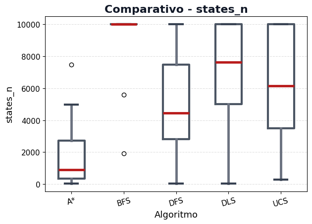
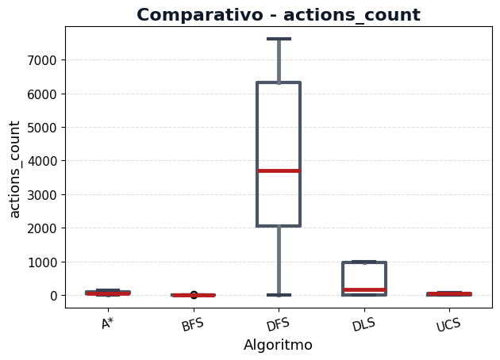
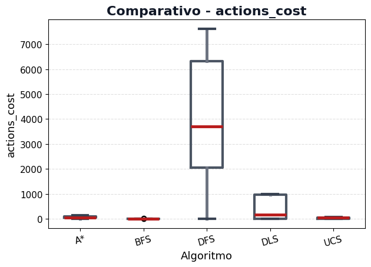
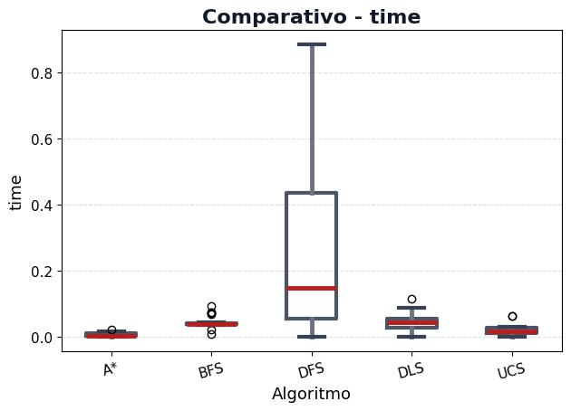
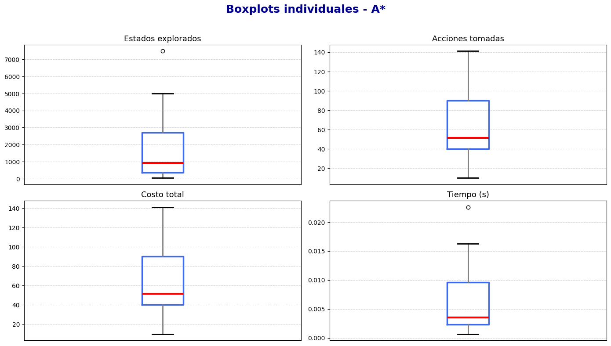
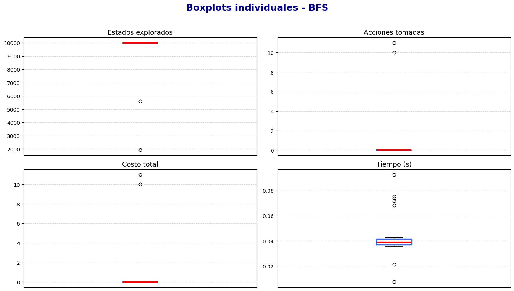
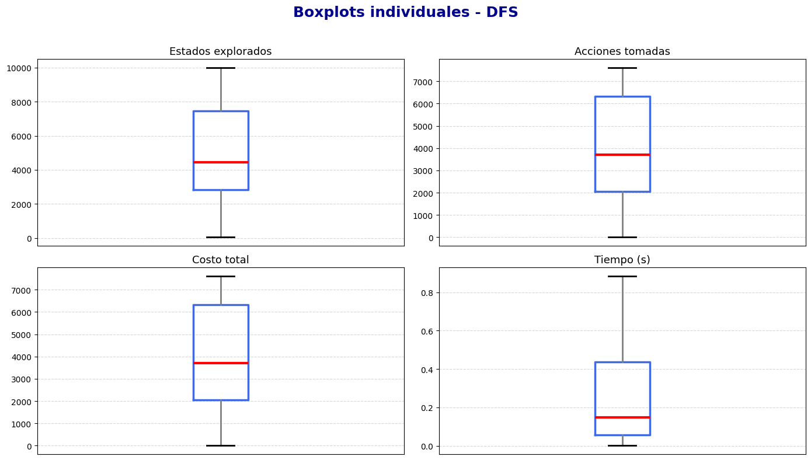
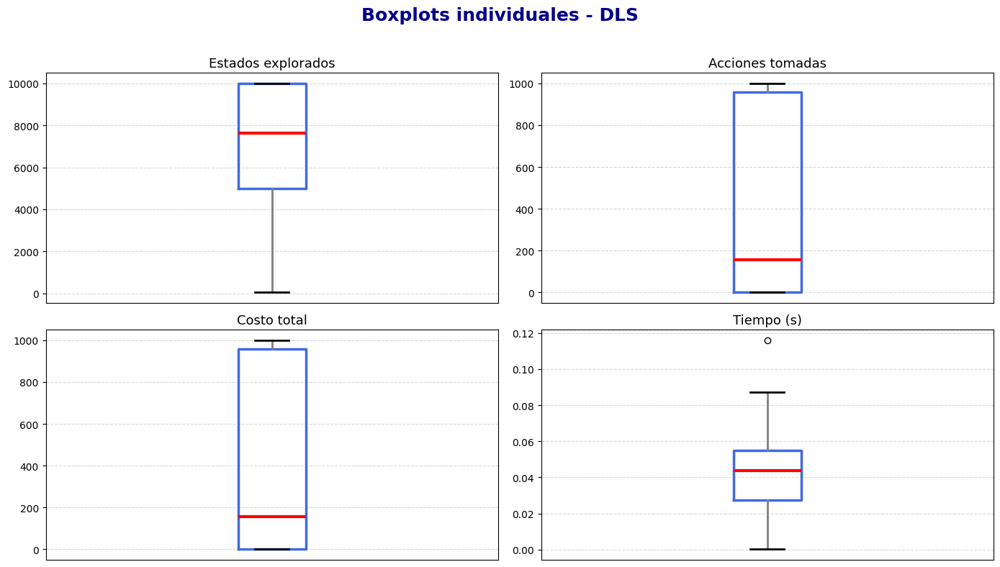
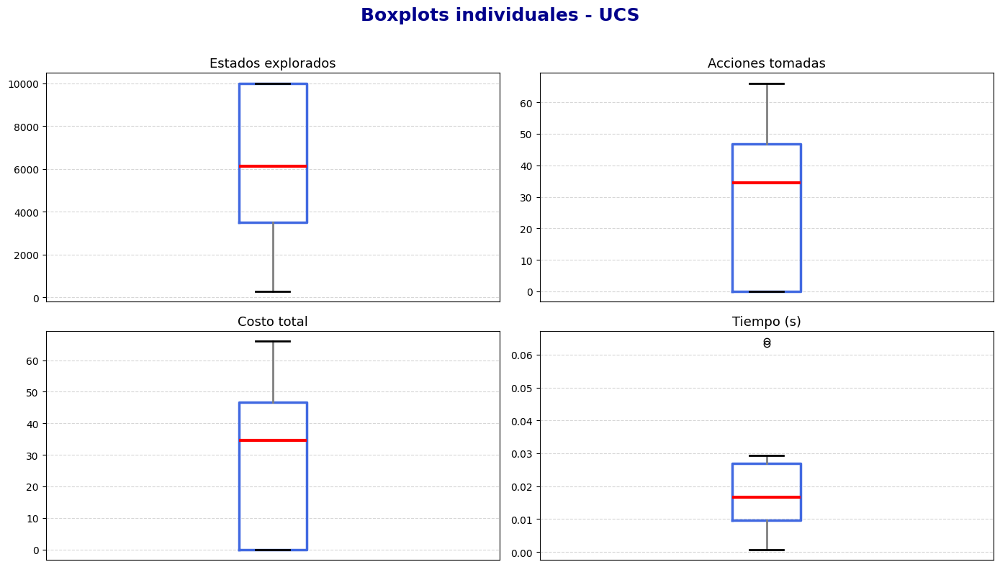

# Informe de Desempeño – Algoritmos de Búsqueda (FrozenLake)

## Introducción

En este trabajo se realizó una evaluación comparativa del desempeño de los algoritmos de búsqueda no informada e informada en el entorno **FrozenLake**, considerando su capacidad de exploración, costo, eficiencia y tiempo de ejecución.  
El objetivo principal fue analizar cómo cada método enfrenta un mismo entorno determinista y con obstáculos aleatorios, evaluando sus ventajas y limitaciones.

Los algoritmos evaluados fueron:

- **DFS (Depth-First Search)**
- **BFS (Breadth-First Search)**
- **DLS (Depth-Limited Search)**
- **UCS (Uniform-Cost Search)**
- **A\*** (A-star)

## Descripción del entorno

El entorno es una cuadrícula de **100×100 celdas**, donde cada celda puede ser:

- **Transitable (Frozen)**, con probabilidad 0.92  
- **Obstáculo (Hole)**, con probabilidad 0.08  

El agente parte desde una posición inicial fija y busca alcanzar una meta evitando los agujeros.  
Cada ejecución utiliza una semilla diferente, garantizando entornos reproducibles pero con pequeñas variaciones.

## Metodología experimental

Cada algoritmo se ejecutó **30 veces** sobre entornos generados aleatoriamente.  
En cada ejecución se registraron las siguientes métricas:

- `states_n`: cantidad de estados explorados  
- `actions_count`: cantidad de acciones en la solución  
- `actions_cost`: costo total de las acciones  
- `time`: tiempo total de ejecución en segundos  

Los resultados se guardaron en un archivo CSV (`results.csv`) y se procesaron para obtener estadísticas y gráficos comparativos.

## Estadísticas globales (media ± desviación estándar)

| algorithm_name | states_n_mean | states_n_std | actions_count_mean | actions_count_std | actions_cost_mean | actions_cost_std | time_mean | time_std |
|:---------------|---------------:|--------------:|--------------------:|------------------:|------------------:|-----------------:|-----------:|----------:|
| **A\*** | 1707.87 | 1913.97 | 63.17 | 35.01 | 63.17 | 35.01 | 0.006 | 0.006 |
| **BFS** | 9583.97 | 1655.86 | 0.70 | 2.67 | 0.70 | 2.67 | 0.043 | 0.017 |
| **DFS** | 5122.70 | 2892.82 | 3764.43 | 2499.87 | 3764.43 | 2499.87 | 0.25 | 0.245 |
| **DLS** | 6967.40 | 3130.53 | 406.00 | 451.90 | 406.00 | 451.90 | 0.044 | 0.026 |
| **UCS** | 6287.93 | 3242.95 | 27.63 | 23.07 | 27.63 | 23.07 | 0.019 | 0.015 |

## Comparativos globales

### Estados explorados

### Acciones tomadas

### Costo total

### Tiempo de ejecución

## Boxplots individuales por algoritmo

### A\*

### BFS

### DFS

### DLS

### UCS

## Análisis y discusión de resultados

### 1. Rendimiento general
Los algoritmos **A\*** y **UCS** presentan el **mejor equilibrio** entre costo y tiempo, logrando soluciones óptimas con pocas acciones y un número limitado de estados explorados.  
Ambos son informados o basados en costo, lo que les permite priorizar caminos eficientes.  

En contraste, **DFS** y **DLS** muestran una **gran variabilidad** en los estados explorados y costos, reflejando su comportamiento poco sistemático y su tendencia a profundizar sin considerar el costo total.  

**BFS**, aunque garantiza la solución más corta, es **altamente costoso en exploración**, ya que expande casi todo el espacio de estados antes de hallar la meta.

### 2. Eficiencia temporal
El tiempo de ejecución promedio sigue la tendencia esperada:

> A\* < UCS < DLS ≈ BFS < DFS

Esto confirma que los algoritmos informados son **más eficientes computacionalmente** cuando se dispone de una heurística adecuada.  
**DFS**, al no tener límite ni criterio de optimización, puede consumir mucho tiempo en caminos inútiles.

### 3. Costos y profundidad
- **DFS** tiene los **mayores costos y variabilidad**, ya que puede encontrar soluciones extremadamente largas.  
- **BFS** obtiene las rutas más cortas, pero al costo de una exploración exhaustiva.  
- **A\*** y **UCS** mantienen costos bajos y consistentes, mostrando un excelente compromiso entre optimalidad y rendimiento.

### 4. Estados explorados
La cantidad de estados explorados evidencia la **eficiencia espacial** de cada método:

- **A\*** explora significativamente menos estados que **BFS** o **DFS**, gracias al uso de heurística.  
- **UCS** equilibra bien la exploración y la calidad de la solución.  
- **DLS**, aunque limita la profundidad, no siempre alcanza soluciones si el límite no es suficiente.

### 5. Variabilidad
Los algoritmos **DFS** y **DLS** presentan la **mayor desviación estándar**, lo que indica comportamientos altamente dependientes del entorno.  
En cambio, **A\*** y **UCS** son mucho más **predecibles y estables**.

## Conclusiones finales

- **A\*** es el algoritmo **más eficiente y consistente**, combinando bajo costo, menor cantidad de estados explorados y tiempos reducidos.  
- **UCS** obtiene resultados similares, pero sin heurística, por lo que su desempeño es más variable.  
- **BFS** asegura soluciones cortas, pero con un costo computacional elevado.  
- **DFS** es rápido en entornos pequeños, pero ineficiente en espacios amplios o con obstáculos.  
- **DLS** mejora parcialmente a **DFS**, pero depende del límite de profundidad fijado.

