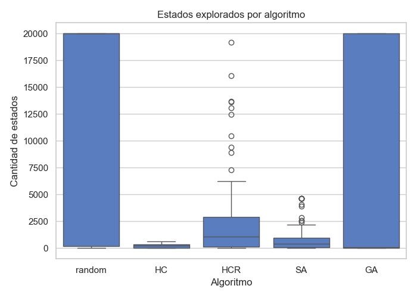
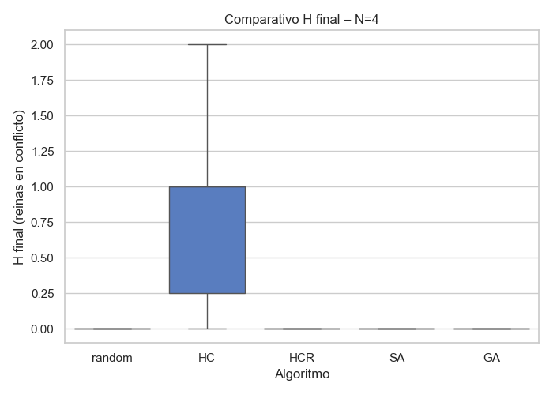
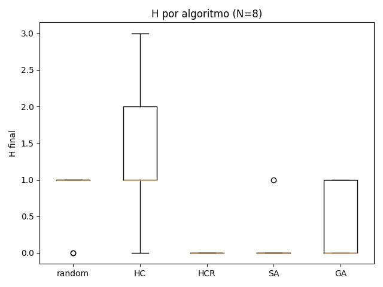
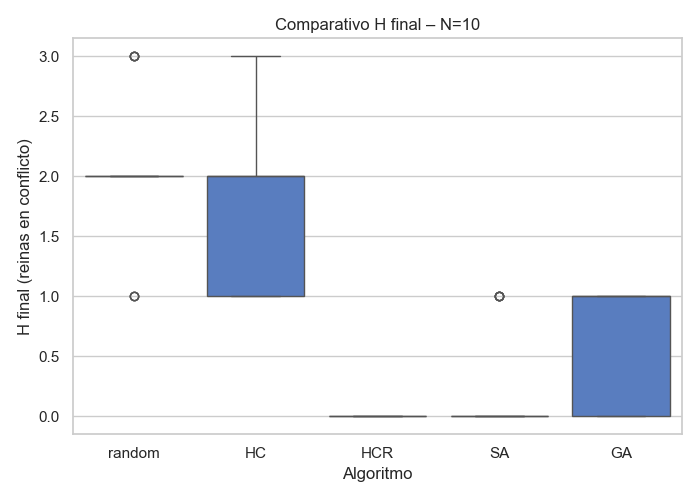
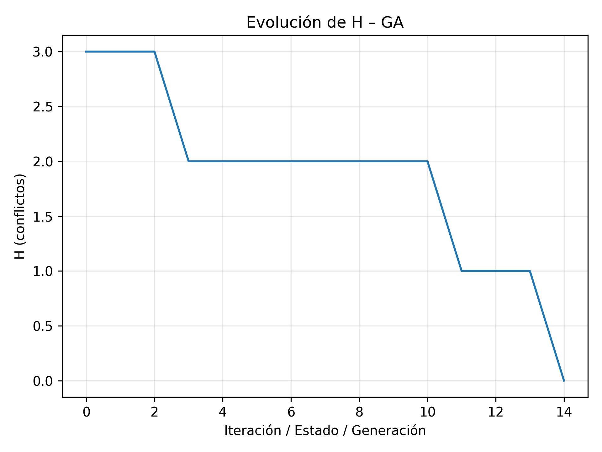
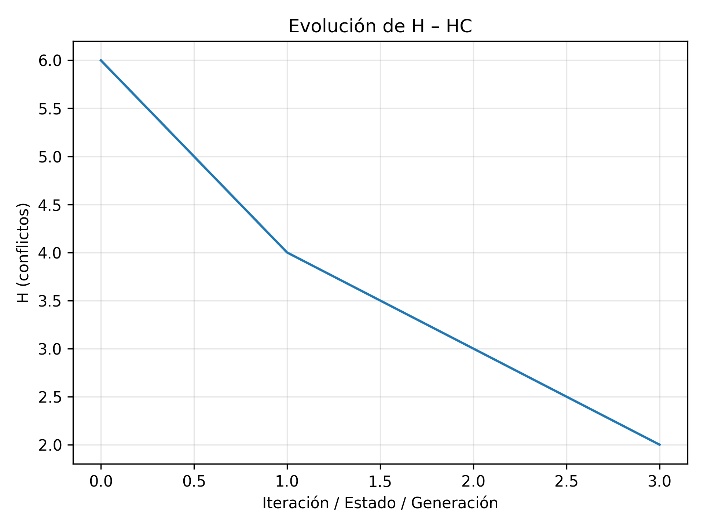
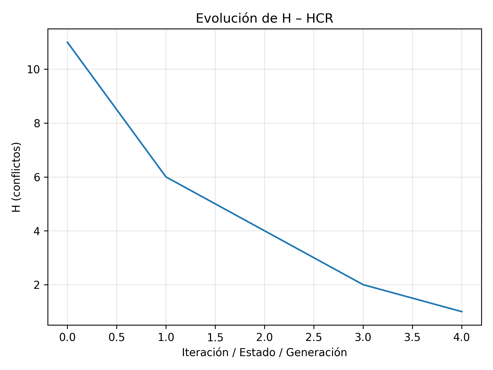
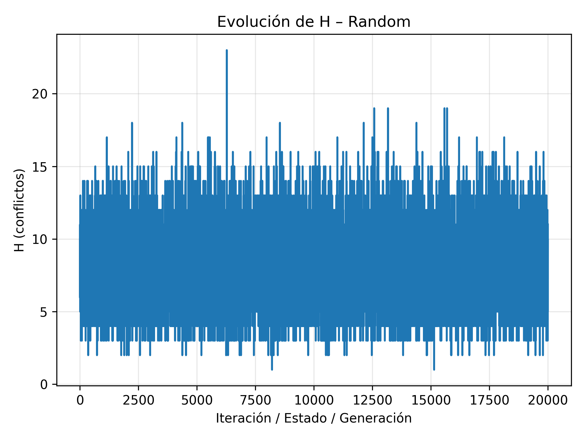
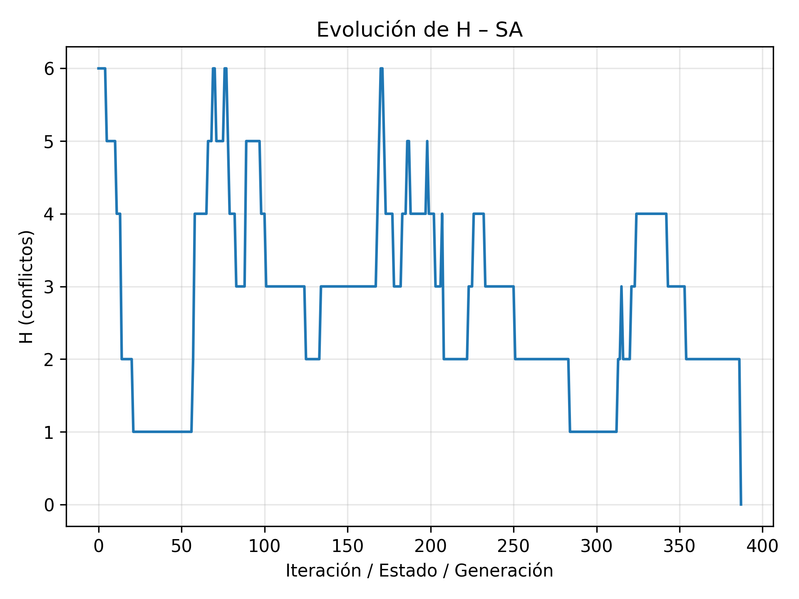
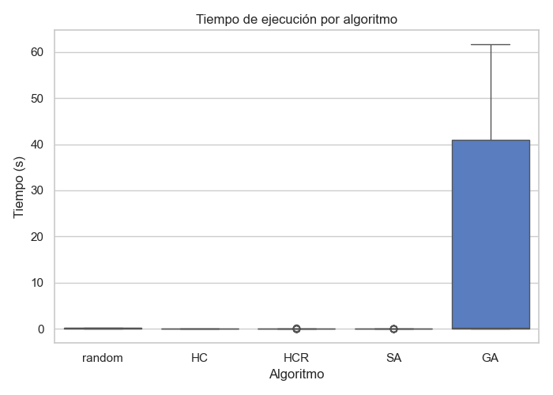

# Informe de Desempeño – Problema de las N-Reinas

## Introducción

El objetivo de este trabajo fue evaluar el rendimiento de distintos algoritmos de optimización aplicados al **problema de las N-Reinas**, comparando su eficiencia, estabilidad y capacidad para alcanzar soluciones óptimas.  

Los métodos implementados fueron:

- **Random**: búsqueda aleatoria sin criterio heurístico.  
- **Hill Climbing (HC)**: búsqueda local determinista.  
- **Hill Climbing Random (HCR)**: variante estocástica con reinicios aleatorios.  
- **Simulated Annealing (SA)**: búsqueda probabilística basada en enfriamiento simulado.  
- **Algoritmo Genético (GA)**: método evolutivo basado en población.  

Cada algoritmo fue ejecutado **30 veces** con diferentes semillas para los tamaños de tablero **N = 4, 8 y 10**, utilizando el mismo número máximo de estados permitidos.

## Descripción del entorno experimental

- **Número máximo de estados**: 20.000  
- **Tamaños evaluados**: N = 4, 8, 10  
- **Repeticiones por configuración**: 30  
- **Métricas registradas**:
  - `H`: valor de la función objetivo (pares de reinas en conflicto)  
  - `states`: cantidad de estados explorados  
  - `time`: tiempo de ejecución (s)  
  - `% éxito`: porcentaje de ejecuciones con `H = 0`

Los resultados fueron procesados en formato CSV (`tp4-Nreinas.csv`) y visualizados mediante gráficos comparativos.

## **Detalles de los algoritmos**

### **Simulated Annealing – Función de enfriamiento (*schedule*)**

Para **Simulated Annealing** se utilizó una función de enfriamiento exponencial dada por:

$$
T(t) = T_0, e^{-\alpha t}
$$

donde:

* (T_0 = 1.0): temperatura inicial
* (\alpha = 0.003): tasa de enfriamiento
* (t): número de iteración

Mientras la temperatura sea alta, el algoritmo acepta soluciones peores con mayor probabilidad.
A medida que (T(t)) disminuye, el comportamiento se vuelve más **greedy**, aceptando cada vez menos empeoramientos.

Además, se incluye un criterio de corte adicional:

$$
T(t) \le 10^{-6}
$$

Cuando esta condición se cumple, el algoritmo se detiene incluso si no se alcanzó (H = 0).

## **Algoritmo Genético – Parámetros y operadores**

Cada individuo se representa como:

$$
\mathbf{x} = (x_1, x_2, \ldots, x_N)
$$

donde (x_i) indica la fila de la reina en la columna (i).

### **Tamaño de población**

$$
\text{Población} = 100
$$

### **Función de fitness**

Basada en los conflictos (H(\mathbf{x})):

$$
\text{fitness}(\mathbf{x}) = \frac{1}{1 + H(\mathbf{x})}
$$

Máximo valor cuando (H = 0):

$$
\text{fitness} = 1
$$

### **Selección (tournament selection)**

Tamaño del torneo:

$$
k = 3
$$

### **Cruzamiento (one-point crossover)**

El punto de corte se elige uniformemente:

$$
c \sim \mathcal{U}(1, N-2)
$$

Los hijos se obtienen combinando los fragmentos de los padres respecto al punto (c).

### **Mutación**

Probabilidad:

$$
p_{\text{mut}} = 0.1
$$

Operador:

$$
x_i \leftarrow \text{rand}(0, N-1)
$$

para una columna seleccionada al azar.

### **Elitismo**

Se conservan:

$$
2 \text{ individuos con mayor fitness}
$$

sin alteración.

### **Criterio de terminación**

El algoritmo finaliza cuando:

1. Se encuentra una solución óptima:

   $$
   H(\mathbf{x}) = 0
   $$

2. Se alcanza el máximo número de generaciones:

   $$
   g = \text{max_generaciones}
   $$

## Resultados y análisis

### 1. Estados explorados por algoritmo

Los algoritmos **random** y **GA** alcanzaron en la mayoría de los casos el **límite máximo de estados (20.000)**, evidenciando un comportamiento intensivo en exploración.  
Por el contrario, **Hill Climbing** y **Simulated Annealing** mostraron un número significativamente menor de estados evaluados, lo que refleja una convergencia más rápida.  
**HCR** se ubica en un punto intermedio, con una mayor dispersión debido a los reinicios aleatorios.

### 2. Comparativo del valor de H final

#### N = 4

Para **N=4**, casi todos los algoritmos alcanzan una solución óptima (`H=0`) en la mayoría de las ejecuciones, excepto Hill Climbing, que presenta cierta variabilidad.

#### N = 8

En **N=8**, los métodos **Simulated Annealing** y **HCR** mantienen un desempeño óptimo y estable (`H=0` constante).  
**Hill Climbing** comienza a evidenciar su principal limitación: **atascarse en óptimos locales**, mientras que el algoritmo genético presenta ligera variabilidad en los resultados.

#### N = 10

En **N=10**, la brecha entre métodos se hace más notoria:  
**SA** y **HCR** siguen encontrando soluciones óptimas, mientras que **GA** y **HC** muestran soluciones parciales con `H>0`.  
El algoritmo aleatorio rara vez alcanza el estado óptimo, demostrando su ineficiencia en espacios de búsqueda más complejos.

# Evolución de la función H a lo largo de una ejecución

Además del análisis estadístico global basado en 30 ejecuciones por configuración, se incluye un estudio complementario donde se observa la **evolución de la función objetivo (H)** a lo largo de las iteraciones para **una única ejecución representativa de cada algoritmo**.

Este análisis permite visualizar cómo progresa cada método en el espacio de búsqueda, mostrando sus patrones típicos de convergencia:

* **Random:** comportamiento errático sin tendencia sistemática a la mejora.
* **Hill Climbing (HC):** descenso rápido seguido de estancamiento en el primer óptimo local.
* **Hill Climbing con Reinicios (HCR):** sucesivas caídas bruscas tras reinicios.
* **Simulated Annealing (SA):** curva suave con pequeñas oscilaciones debido a la aceptación probabilística de empeoramientos.
* **Algoritmo Genético (GA):** mejora escalonada reflejando el progreso generacional.

### Algoritmo Genético (GA)

### Hill Climbing (HC)

### Hill Climbing con Reinicios (HCR)

### Random Search

### Simulated Annealing (SA)

### 3. Tiempos de ejecución

El análisis temporal muestra diferencias sustanciales entre los métodos.  
Los algoritmos **HC**, **HCR** y **SA** poseen tiempos muy bajos y estables, demostrando una rápida convergencia.  
En contraste, el **Algoritmo Genético (GA)** presenta tiempos promedio mucho mayores (superiores a 40 s), reflejando el costo computacional de manejar una población y múltiples generaciones.  
El método **random** también consume mucho tiempo debido a la exploración exhaustiva e ineficiente.

## Conclusiones

- **Hill Climbing (HC)**: rápido y simple, pero tiende a estancarse en óptimos locales.  
- **Hill Climbing Random (HCR)**: mejora el rendimiento mediante reinicios aleatorios, alcanzando más soluciones óptimas que HC.  
- **Simulated Annealing (SA)**: ofrece el **mejor equilibrio** entre tiempo de ejecución, estabilidad y tasa de éxito, siendo el más consistente en todas las configuraciones.  
- **Algoritmo Genético (GA)**: alcanza buenas soluciones, pero con **altos costos computacionales**, lo que lo hace menos eficiente para tableros pequeños o medianos.  
- **Random**: sirve como línea base, pero demuestra ser **ineficiente** en exploración y convergencia.

**Conclusión final:**  
Los métodos de búsqueda local con componente estocástico (SA, HCR) demostraron ser más eficientes y robustos ante variaciones del entorno, validando la importancia del azar controlado para escapar de óptimos locales y mejorar la convergencia global.
