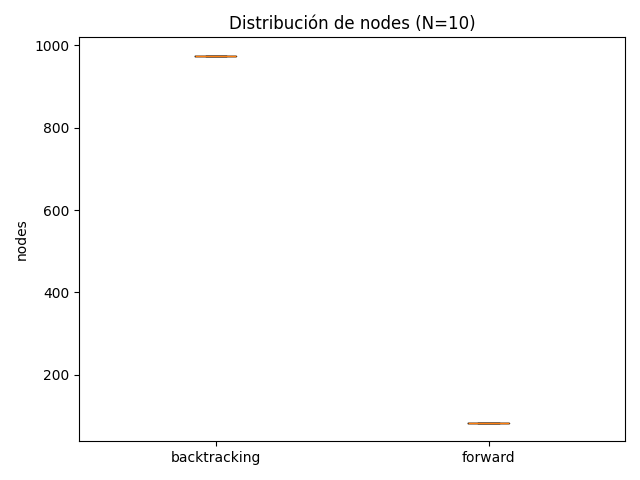
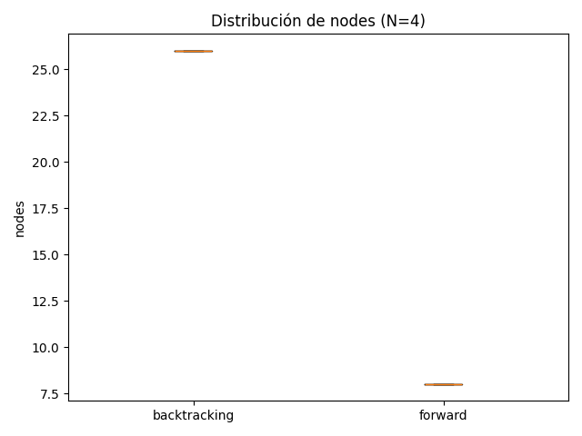
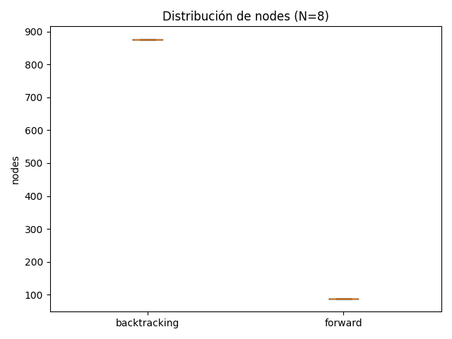
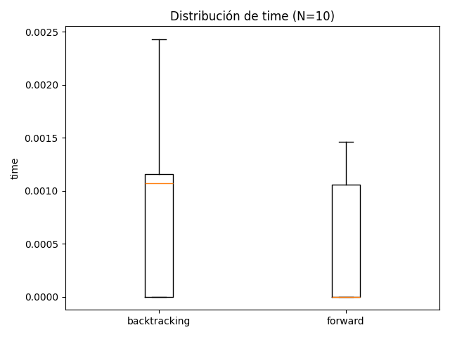
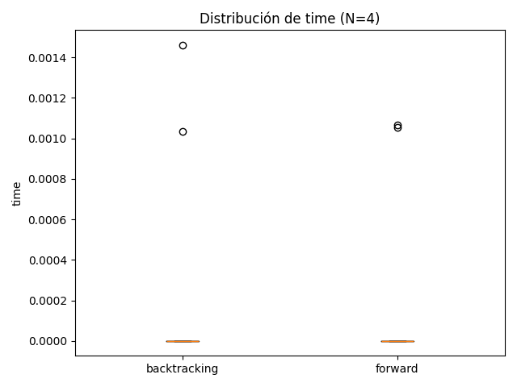
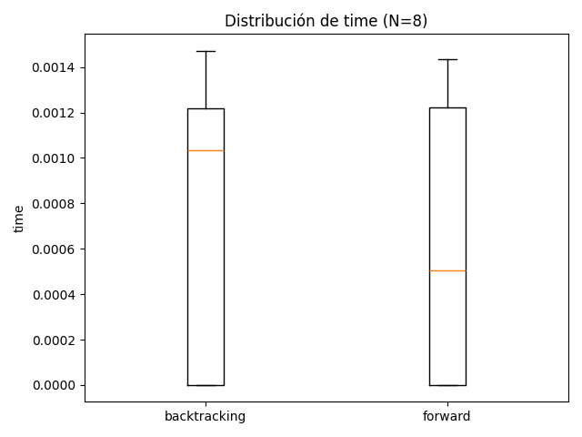

# 🧩 TP5 – Experimentos CSP (N-Reinas)

## 1. Descripción general

En este experimento se evaluaron dos algoritmos de resolución del problema de las N-Reinas formulado como un **Problema de Satisfacción de Restricciones (CSP)**:

- **Backtracking clásico**: búsqueda en profundidad con verificación de consistencia.
- **Forward Checking**: versión mejorada que realiza poda de dominios luego de cada asignación parcial.

Cada algoritmo fue ejecutado **30 veces con semillas distintas** para los tamaños de tablero **N = 4, 8 y 10**.  
Se registraron el **tiempo de ejecución**, la **cantidad de nodos explorados** y si se **encontró una solución válida**.

---

## 2. Resultados globales

| Algoritmo | N | Éxito (%) | Tiempo medio (s) | Desv. tiempo | Nodos medios | Desv. nodos |
|------------|---|------------|------------------|--------------|---------------|-------------|
| backtracking | 4 | 100.0 | 0.0 | 0.0 | 26.0 | 0.0 |
| backtracking | 8 | 100.0 | 0.00093 | 0.00071 | 876.0 | 0.0 |
| backtracking | 10 | 100.0 | 0.00092 | 0.00057 | 975.0 | 0.0 |
| forward | 4 | 100.0 | 3e-05 | 0.00019 | 8.0 | 0.0 |
| forward | 8 | 100.0 | 0.00048 | 0.00057 | 88.0 | 0.0 |
| forward | 10 | 100.0 | 0.00081 | 0.00051 | 83.0 | 0.0 |

---

## 3. Gráficos

A continuación se muestran los **boxplots** de las distribuciones de tiempos de ejecución y de nodos explorados:

### boxplot_nodes_N10.png

### boxplot_nodes_N4.png

### boxplot_nodes_N8.png

### boxplot_time_N10.png

### boxplot_time_N4.png

### boxplot_time_N8.png

---

## 4. Conclusión

- El algoritmo **Forward Checking** muestra una clara reducción en la cantidad promedio de nodos explorados y en el tiempo medio de ejecución.
- Ambos algoritmos alcanzan el 100% de éxito para tableros pequeños (N ≤ 10), aunque la diferencia de rendimiento se acentúa a medida que aumenta N.
- El **Backtracking clásico** presenta mayor variabilidad temporal y un crecimiento más pronunciado del número de nodos, evidenciando su naturaleza exponencial.
- Por tanto, **Forward Checking** resulta más adecuado para resolver CSPs como el de las N-Reinas, ya que mejora la eficiencia sin sacrificar exactitud.

---

*Generado automáticamente por `generate_csp_report.py` a partir de los resultados de `run_csp_experiments.py`.*
