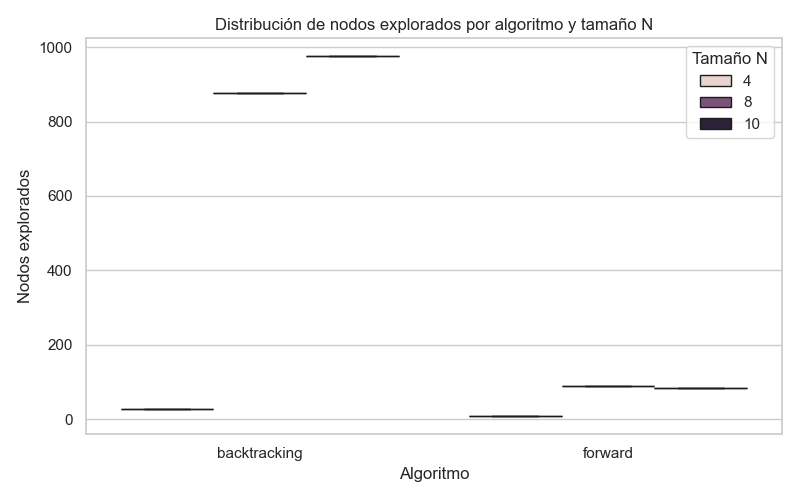
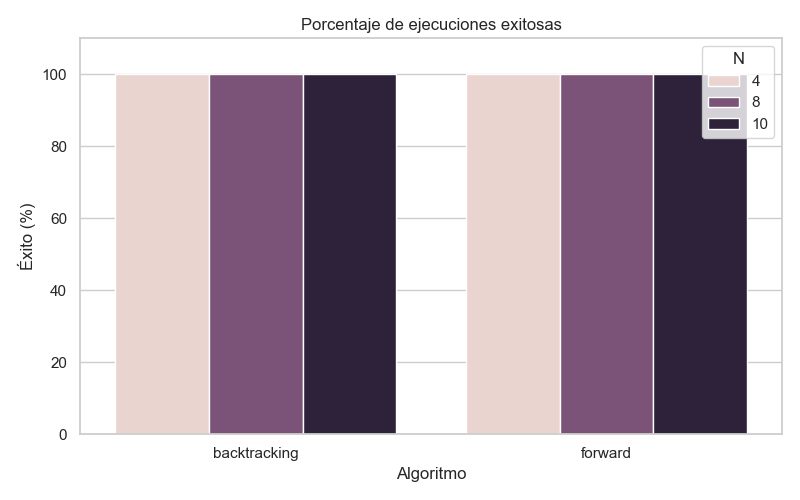
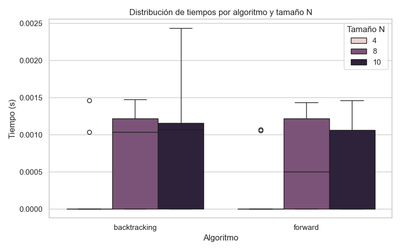
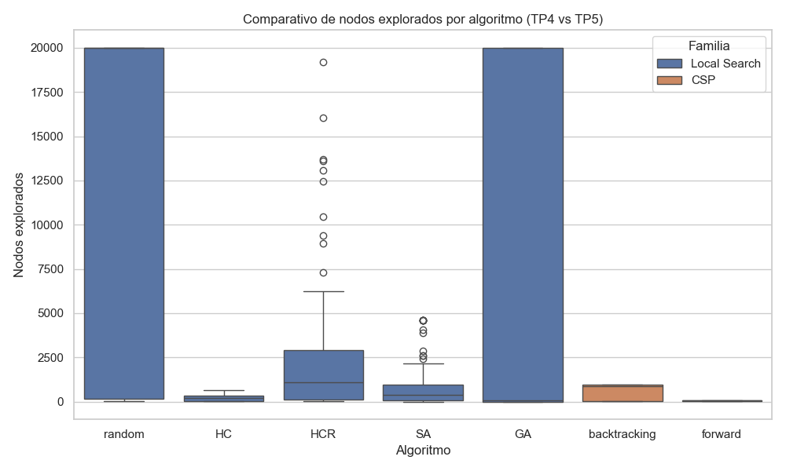
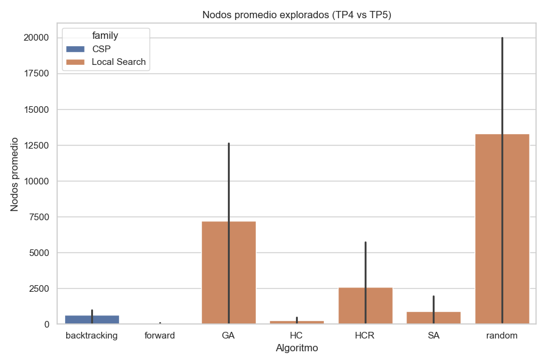
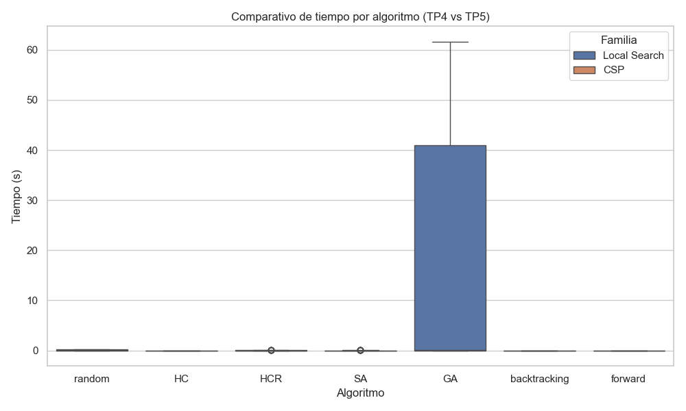
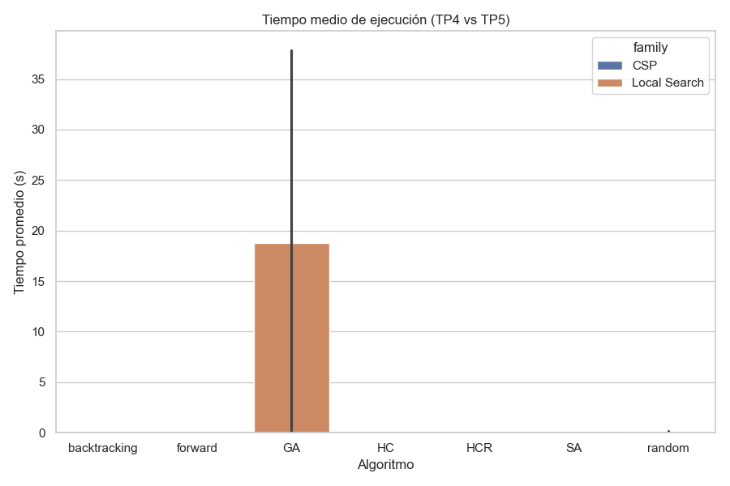

# Informe Final – N-Reinas (TP4 y TP5)

## 1. Resultados del TP5 – CSP (Backtracking vs Forward Checking)

En este trabajo se evaluaron los algoritmos **Backtracking clásico** y **Forward Checking** aplicados al problema de las N-Reinas, formulado como un **Problema de Satisfacción de Restricciones (CSP)**.

Cada algoritmo fue ejecutado **30 veces** para los tamaños **N = 4, 8 y 10**, registrando el tiempo, los nodos explorados y la tasa de éxito (soluciones válidas encontradas).

### Tabla resumen de resultados
| algorithm | N | success_% | time_mean | time_std | nodes_mean | nodes_std |
| --- | --- | --- | --- | --- | --- | --- |
| backtracking | 4 | 100.0 | 8.3e-05 | 0.000322 | 26.0 | 0.0 |
| backtracking | 8 | 100.0 | 0.000723 | 0.000613 | 876.0 | 0.0 |
| backtracking | 10 | 100.0 | 0.000843 | 0.000745 | 975.0 | 0.0 |
| forward | 4 | 100.0 | 7.1e-05 | 0.000269 | 8.0 | 0.0 |
| forward | 8 | 100.0 | 0.000612 | 0.000633 | 88.0 | 0.0 |
| forward | 10 | 100.0 | 0.000475 | 0.0006 | 83.0 | 0.0 |

### Gráficos de desempeño

## Gráficos de TP5 – CSP

### Conclusiones del TP5

- **Forward Checking** logra una mejora notable respecto al **Backtracking clásico**, reduciendo significativamente el número de nodos explorados.
- Ambos alcanzan un **100% de éxito** en tableros pequeños, pero **Backtracking** crece exponencialmente en costo al aumentar N.
- En términos de tiempo, **Forward Checking** mantiene un comportamiento más estable y eficiente.
- La poda anticipada de dominios en cada asignación es clave para reducir la explosión combinatoria.

## 2. Comparación General – Búsquedas Locales (TP4) vs CSP (TP5)

Esta comparación integra los resultados del **TP4 (búsquedas locales: HC, HCR, SA, GA, Random)** y el **TP5 (CSP: Backtracking, Forward Checking)**.

Se busca analizar diferencias en:
- **Eficiencia temporal**
- **Nodos explorados**
- **Tasa de éxito**

### Muestra parcial de datos (TP4)
| algorithm_name | env_n | size | best_solution | H | states | time |
| --- | --- | --- | --- | --- | --- | --- |
| random | 0 | 4 | [2, 0, 3, 1] | 0 | 68 | 0.0 |
| HC | 0 | 4 | [1, 3, 0, 2] | 0 | 13 | 0.00106 |
| HCR | 0 | 4 | [1, 3, 0, 2] | 0 | 13 | 0.0 |
| SA | 0 | 4 | [1, 3, 0, 2] | 0 | 55 | 0.0 |
| GA | 0 | 4 | [2, 0, 3, 1] | 0 | 0 | 0.0 |
| random | 1 | 4 | [2, 0, 3, 1] | 0 | 21 | 0.0 |
| HC | 1 | 4 | [1, 3, 2, 0] | 1 | 25 | 0.0 |
| HCR | 1 | 4 | [2, 0, 3, 1] | 0 | 62 | 0.0 |
| SA | 1 | 4 | [2, 0, 3, 1] | 0 | 28 | 0.0 |
| GA | 1 | 4 | [2, 0, 3, 1] | 0 | 0 | 0.001068 |

### Gráficos comparativos

## Comparativa TP4 vs TP5

### Análisis comparativo

- Los métodos **CSP (Backtracking, Forward Checking)** garantizan **soluciones exactas**, pero con tiempos de ejecución más altos en N grandes.
- Los algoritmos de **búsqueda local (SA, HCR)** ofrecen soluciones rápidas y aproximadas, alcanzando buenos resultados en tiempo, aunque sin garantía de optimalidad.
- **Simulated Annealing (SA)** se posiciona como el mejor entre los métodos locales: rápido, robusto y consistente.
- **Forward Checking (CSP)** domina en exactitud y control de nodos, aunque a un costo computacional mayor en escalas grandes.

### Conclusión global

| Criterio | Local Search (TP4) | CSP (TP5) |
|-----------|-------------------|------------|
| Exactitud | Parcial (dependiente de heurística) | Completa (garantiza solución) |
| Escalabilidad | Alta para N moderado | Limitada por crecimiento exponencial |
| Robustez | Alta (en SA y GA) | Alta (en FC) |
| Tiempo | Bajo–medio | Medio–alto |
| Mejor método | **Simulated Annealing (SA)** | **Forward Checking (FC)** |

## 3. Conclusión Final Integrada

- **Forward Checking (CSP)** sobresale por su precisión y control, siendo ideal para validación o demostración de soluciones exactas.
- **Simulated Annealing (Local Search)** se destaca por su velocidad y adaptabilidad, siendo más adecuado para problemas grandes o con restricciones suaves.
- Ambos enfoques son complementarios: uno garantiza optimalidad, el otro eficiencia práctica.
