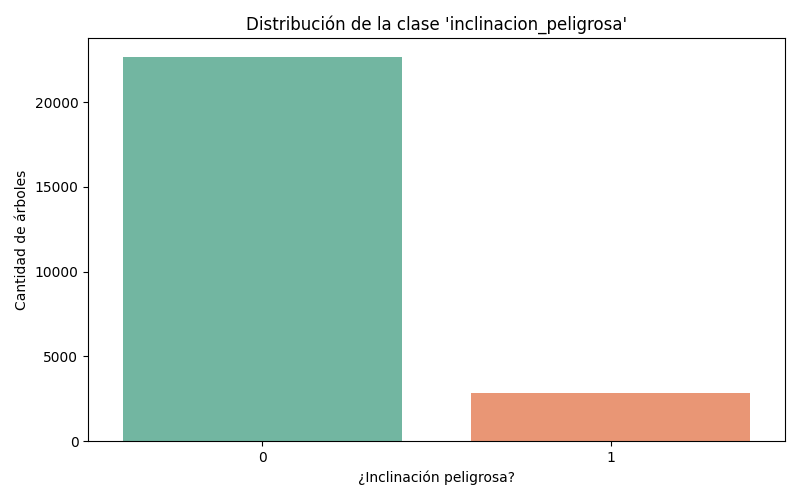
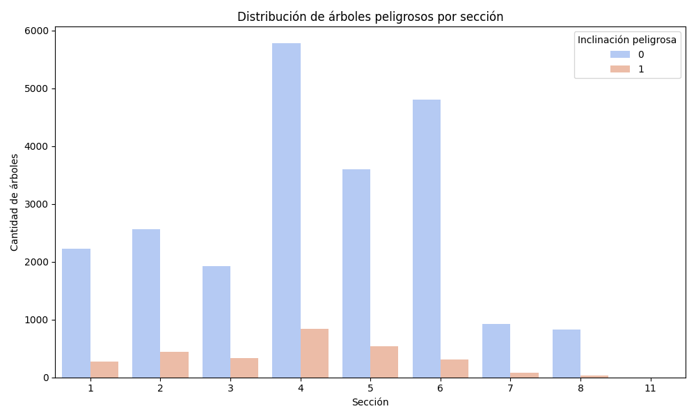
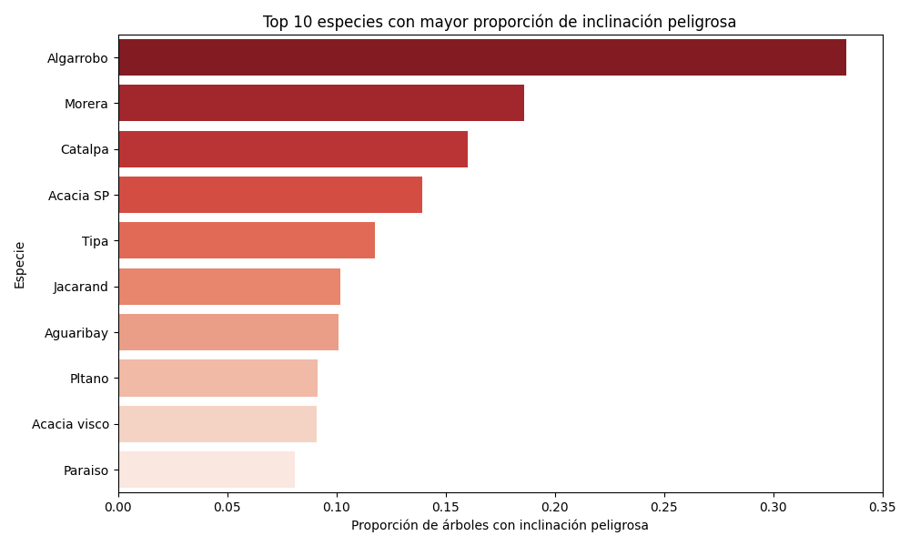
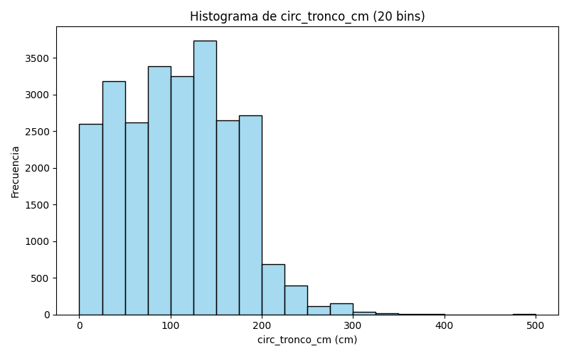
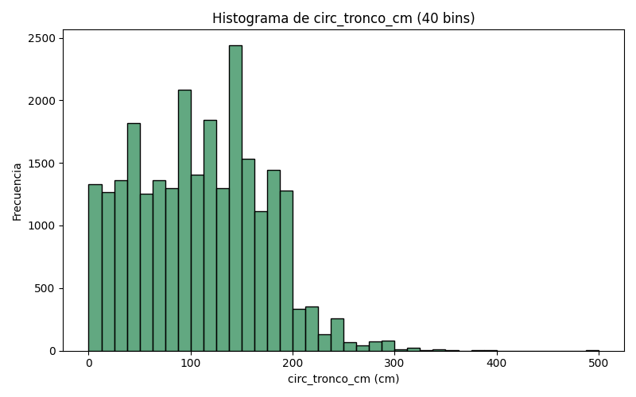
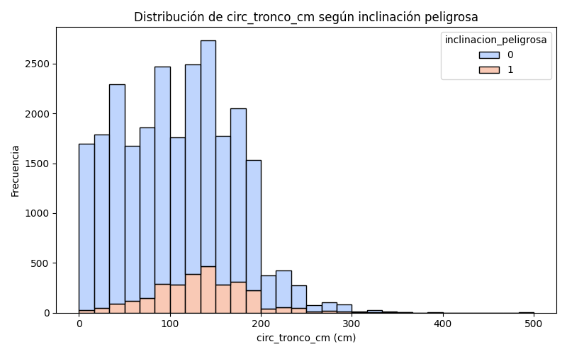

# TP7B – Análisis Exploratorio de Datos (EDA)

## Distribución de la clase `inclinacion_peligrosa`

**Interpretación:** La mayoría de los árboles **no presentan inclinación peligrosa**, lo que indica un **conjunto de datos desbalanceado**.

## Secciones más peligrosas

**Interpretación:** Las secciones con mayor proporción de árboles con inclinación peligrosa son las siguientes: . Estas zonas pueden considerarse **más riesgosas**.

## Especies más peligrosas

**Interpretación:** Las especies con mayor proporción de árboles con inclinación peligrosa pueden considerarse más vulnerables estructuralmente o menos adaptadas a las condiciones del entorno urbano. 

## Análisis de circ_tronco_cm y creación de variable categórica

### Histograma de frecuencia de `circ_tronco_cm`

**Interpretación:** La variable `circ_tronco_cm` presenta una distribución sesgada hacia valores bajos. La mayoría de los árboles poseen circunferencias menores a 150 cm, lo que indica predominancia de ejemplares de tamaño medio o pequeño. La densidad disminuye a medida que aumenta el diámetro del tronco.

### Distribución por clase `inclinacion_peligrosa`

**Interpretación:** Al separar por la clase `inclinacion_peligrosa`, se observa que los árboles con mayor circunferencia presentan una ligera mayor frecuencia de inclinaciones peligrosas. Esto sugiere que el tamaño y la edad podrían estar asociados a un mayor riesgo estructural.

### Creación de la variable categórica `circ_tronco_cm_cat`

| Categoría | Rango (cm) |
|------------|-------------|
| bajo | 0 – 60 |
| medio | 60 – 120 |
| alto | 120 – 200 |
| muy alto | > 200 |

**Interpretación:** Se crearon cuatro categorías a partir de los histogramas:  
- **bajo:** 0–60 cm  
- **medio:** 60–120 cm  
- **alto:** 120–200 cm  
- **muy alto:** >200 cm  
Esta transformación facilita el análisis de la variable y permitirá evaluar relaciones con otras variables de riesgo.
