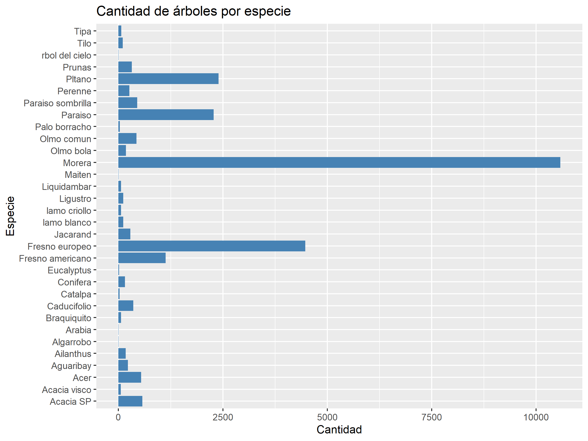
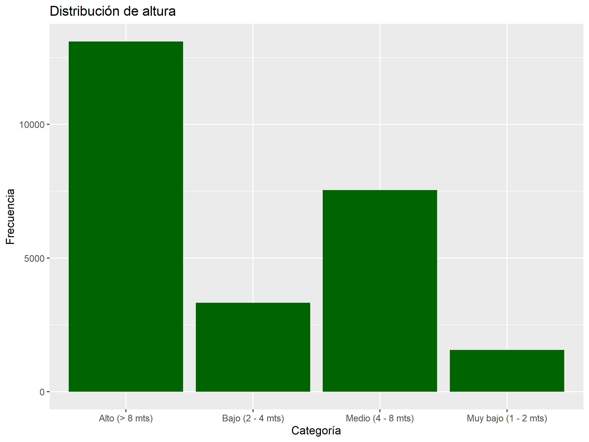
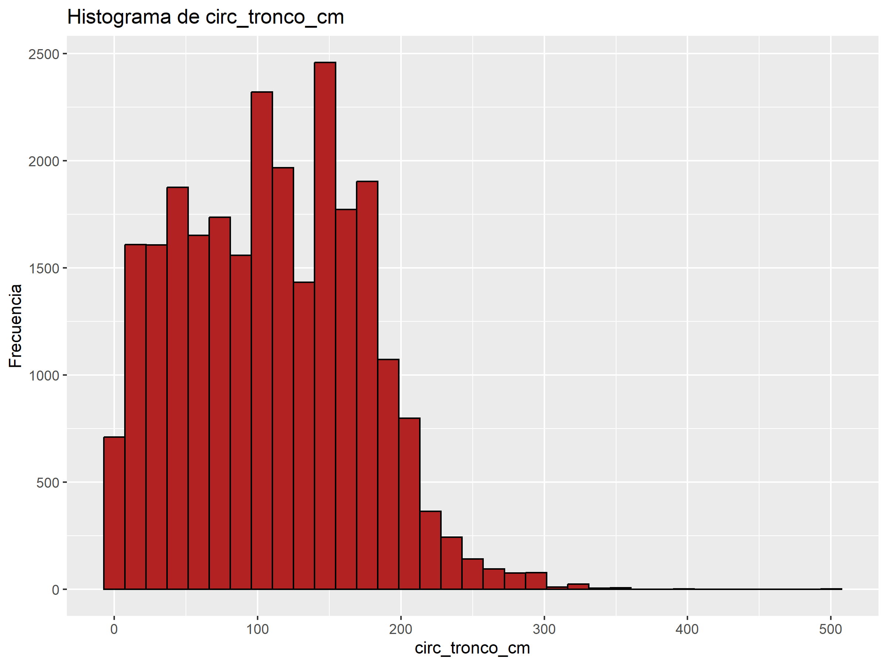
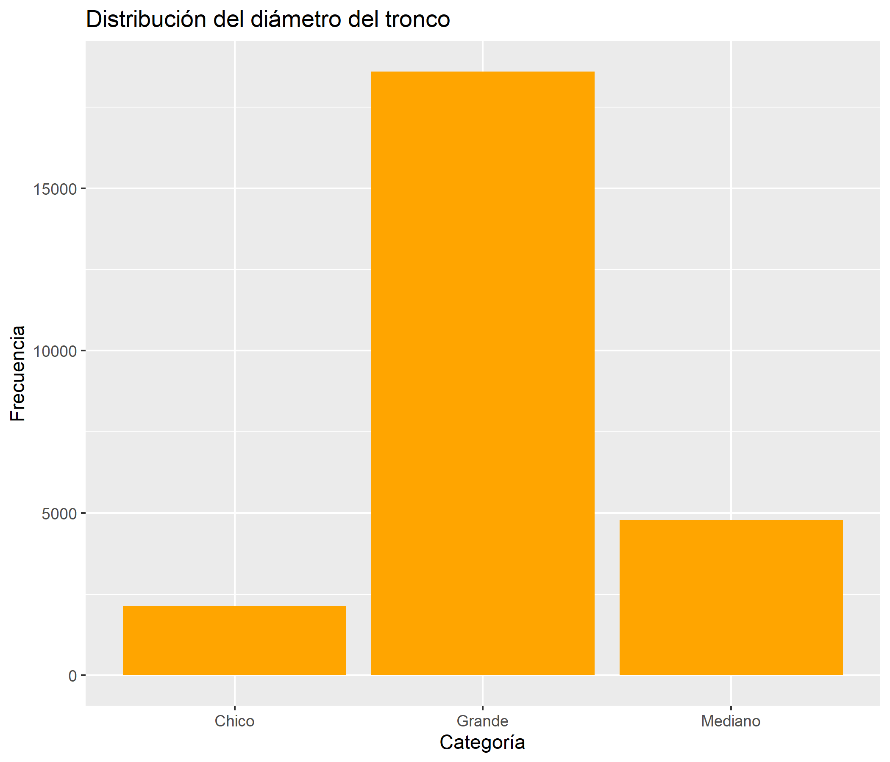

## Análisis Exploratorio de Datos

### Cantidad por especie

### Distribución de alturas

### Histograma de circ_tronco_cm

### Distribución diámetro del tronco

## Criterio de corte para circ_tronco_cm

Se seleccionaron cortes basados en los valles del histograma:

| Rango | Categoría |
|--------|-----------|
| 0–60 | bajo |
| 60–120 | medio-bajo |
| 120–160 | medio-alto |
| >160 | alto |

